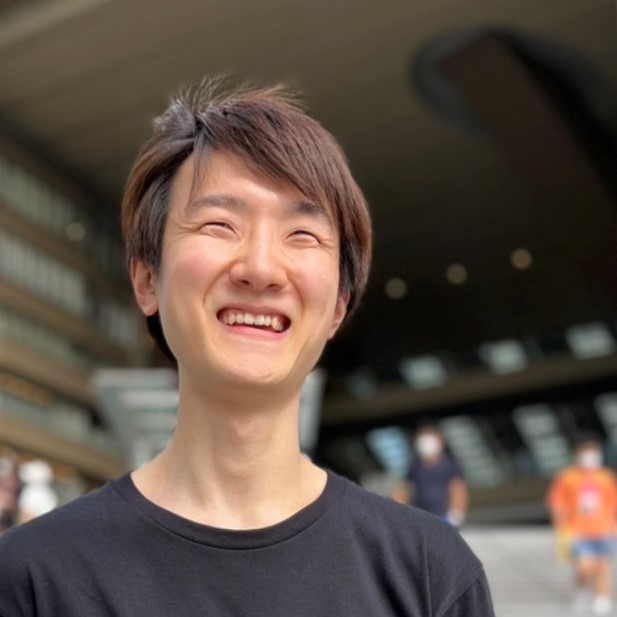

---

layout: home

title: About

google_analytics: UA-NNNNNNNN-N

---

  

    
    Hydroptical | UIST' 24
      
    
    Visuo-Thermal | SIGGRAPH '22
      
    
    Redirection thru Heat
      
  

  

    
    Swarm Body | CHI '24
      
    
    RattlEye | SIGGRAPH '22
      
    
    ThermoBlinds | UbiComp '22
      
  

  

    
    Thermal Painting | TEI '26 WiP
      
    
    Swell by Light | TEI '25
      
    
    Everyday Thermal | TEI '25
      
  

 

<section class="profile">

  <figure class="profImage">
    
    <figcaption class="profile-links">
      <a class="hover-text" href="/assets/pdfs/Sosuke_Ichihashi_CV_Dec_2025.pdf">Download CV</a>
      |
      <a class="hover-text" href="https://twitter.com/RefreshSource">
        Follow me 
        
      </a>
      |
      <a class="hover-text" href="https://sosuke-ichihashi.com/value/">My Value</a>
    </figcaption>
  </figure>

  

    

      <em>From Visual to Multimodal. From Information to Energy.</em> 
      Read the full version <a href="vision">here.</a>  
      Sosuke, a PhD student at Georgia Tech, creates new ways for humans to interact with the world by repurposing visual media into multimodal experiences. For instance, <a href="https://sites.gatech.edu/futurefeelings/2024/11/14/hydroptical-thermal-feedback-uist-24/">Hydroptical Thermal Feedback</a> creates the illusion of instant water temperature changes using LED-based skin heating, without altering the water's actual temperature. <a href="https://sosuke-ichihashi.com/thermoblinds/">ThermoBlinds</a> draws inspiration from liquid crystal displays (LCDs) to deliver fast-switching thermal sensations, while <a href="https://sites.gatech.edu/futurefeelings/2025/03/07/swell-by-light-tei-25/">Swell by Light</a> leverages a standard office printer to generate 2.5D tactile textures. These projects demonstrate how visual media technologies can transcend simple information display, reshaping the physical world and our perception of it by directly mediating energy. 
      This approach seeks to return us to <a href="https://doi.org/10.1145/3689050.3704423">more organic, synesthetic, and multimodal way</a> of interacting with our environment and each other, enhanced by the magic of computing.
      <a href="https://sites.gatech.edu/futurefeelings/2024/11/14/hydroptical-thermal-feedback-uist-24/">Hydroptical Bath</a>, for example, offers a meditative, relaxing experience with physiological benefits. Similarly, <a href="https://sites.gatech.edu/futurefeelings/2026/03/14/thermal-painting-tei-26-wip/">Thermal Painting</a> augments an artist's creativity with multimodal paints that evoke both thermal and color sensations.
      Ultimately, Sosuke's research pulls magical experiences out from behind the sceen, integrating physiological, emotional, and behavioral changes into our media experiences. 
      In the age of electricity, optical patterns were of such low energy that they could only conveyed information, functioning merely as visual media.
      However, as we learn to control higher-energy patterns, we are giving rise to what Sosuke calls "energy media."
      What were once mere visual representations will come to give thermal, tactile, kinetic, olfactory, and gustatory sensations.
      What was once mere information will come to exert physiological, emotional, and motivational impacts on us humans.
      These high-energy patterns will morph, heat, power, and control physical matter and computing systems.
    

  

</section>

## Publications

<ol reversed style="font-size:18px; font-weight:480">

  <li>
    
Thermal and Tactile Integration in Human Liquid Perception Using Viscous Solutions and Visible Light 
      
        Junjie Hua, <strong>Sosuke Ichihashi</strong>, Hsin-Ni Ho 
        <a class="hover-text" href="">
          <svg style="vertical-align: middle" width="12" height="16" xmlns="http://www.w3.org/2000/svg" viewBox="0 0 384 512"><path d="M0 64C0 28.7 28.7 0 64 0L224 0l0 128c0 17.7 14.3 32 32 32l128 0 0 288c0 35.3-28.7 64-64 64L64 512c-35.3 0-64-28.7-64-64L0 64zm384 64l-128 0L256 0 384 128z"/></svg>
          IEEE Haptics '26 Paper (to appear)
        </a>&nbsp;
        <!-- <a class="hover-text" href="https://sites.gatech.edu/futurefeelings/2025/03/07/swell-by-light-tei-25/">
          <svg style="vertical-align: middle" width="12" height="16" xmlns="http://www.w3.org/2000/svg" viewBox="0 0 512 512"><path d="M224.6 12.8c56.2-56.2 147.4-56.2 203.6 0s56.2 147.4 0 203.6l-164 164c-34.4 34.4-90.1 34.4-124.5 0s-34.4-90.1 0-124.5L292.5 103.3c12.5-12.5 32.8-12.5 45.3 0s12.5 32.8 0 45.3L185 301.3c-9.4 9.4-9.4 24.6 0 33.9s24.6 9.4 33.9 0l164-164c31.2-31.2 31.2-81.9 0-113.1s-81.9-31.2-113.1 0l-164 164c-53.1 53.1-53.1 139.2 0 192.3s139.2 53.1 192.3 0L428.3 284.3c12.5-12.5 32.8-12.5 45.3 0s12.5 32.8 0 45.3L343.4 459.6c-78.1 78.1-204.7 78.1-282.8 0s-78.1-204.7 0-282.8l164-164z"/></svg>
          Project Page
        </a>&nbsp; -->
         
        <b style="color:#d92b00;">Best Technical Long Paper Award</b>
      
    

  </li>

  <li>
    
Designing for Defamiliarization with Thermal Painting: Exploring Experiences of Dynamic Warmth in Painters' Creative Processes 
      
        Supratim Pait, <strong>Sosuke Ichihashi</strong>, Xingyu Li, Haiqing Xu, Noura Howell 
        <a class="hover-text" href="https://doi.org/10.1145/3731459.3779344">
          <svg style="vertical-align: middle" width="12" height="16" xmlns="http://www.w3.org/2000/svg" viewBox="0 0 384 512"><path d="M0 64C0 28.7 28.7 0 64 0L224 0l0 128c0 17.7 14.3 32 32 32l128 0 0 288c0 35.3-28.7 64-64 64L64 512c-35.3 0-64-28.7-64-64L0 64zm384 64l-128 0L256 0 384 128z"/></svg>
          TEI '26 WiP, Demo
        </a>&nbsp;
        <a class="hover-text" href="https://youtu.be/rIGO8lKhb8M?si=iAJTmvGKnIaTQ33V">
          <svg width="18" height="16" xmlns="http://www.w3.org/2000/svg" viewBox="0 0 576 512"><path d="M549.7 124.1c-6.3-23.7-24.8-42.3-48.3-48.6C458.8 64 288 64 288 64S117.2 64 74.6 75.5c-23.5 6.3-42 24.9-48.3 48.6-11.4 42.9-11.4 132.3-11.4 132.3s0 89.4 11.4 132.3c6.3 23.7 24.8 41.5 48.3 47.8C117.2 448 288 448 288 448s170.8 0 213.4-11.5c23.5-6.3 42-24.2 48.3-47.8 11.4-42.9 11.4-132.3 11.4-132.3s0-89.4-11.4-132.3zm-317.5 213.5V175.2l142.7 81.2-142.7 81.2z"/></svg>
          video
        </a>&nbsp;
        <a class="hover-text" href="https://github.com/sosucat/ThermalPaint">
          <svg width="20" height="20" xmlns="http://www.w3.org/2000/svg" viewBox="0 0 640 640"><!--!Font Awesome Free v7.2.0 by @fontawesome - https://fontawesome.com License - https://fontawesome.com/license/free Copyright 2026 Fonticons, Inc.--><path d="M237.9 461.4C237.9 463.4 235.6 465 232.7 465C229.4 465.3 227.1 463.7 227.1 461.4C227.1 459.4 229.4 457.8 232.3 457.8C235.3 457.5 237.9 459.1 237.9 461.4zM206.8 456.9C206.1 458.9 208.1 461.2 211.1 461.8C213.7 462.8 216.7 461.8 217.3 459.8C217.9 457.8 216 455.5 213 454.6C210.4 453.9 207.5 454.9 206.8 456.9zM251 455.2C248.1 455.9 246.1 457.8 246.4 460.1C246.7 462.1 249.3 463.4 252.3 462.7C255.2 462 257.2 460.1 256.9 458.1C256.6 456.2 253.9 454.9 251 455.2zM316.8 72C178.1 72 72 177.3 72 316C72 426.9 141.8 521.8 241.5 555.2C254.3 557.5 258.8 549.6 258.8 543.1C258.8 536.9 258.5 502.7 258.5 481.7C258.5 481.7 188.5 496.7 173.8 451.9C173.8 451.9 162.4 422.8 146 415.3C146 415.3 123.1 399.6 147.6 399.9C147.6 399.9 172.5 401.9 186.2 425.7C208.1 464.3 244.8 453.2 259.1 446.6C261.4 430.6 267.9 419.5 275.1 412.9C219.2 406.7 162.8 398.6 162.8 302.4C162.8 274.9 170.4 261.1 186.4 243.5C183.8 237 175.3 210.2 189 175.6C209.9 169.1 258 202.6 258 202.6C278 197 299.5 194.1 320.8 194.1C342.1 194.1 363.6 197 383.6 202.6C383.6 202.6 431.7 169 452.6 175.6C466.3 210.3 457.8 237 455.2 243.5C471.2 261.2 481 275 481 302.4C481 398.9 422.1 406.6 366.2 412.9C375.4 420.8 383.2 435.8 383.2 459.3C383.2 493 382.9 534.7 382.9 542.9C382.9 549.4 387.5 557.3 400.2 555C500.2 521.8 568 426.9 568 316C568 177.3 455.5 72 316.8 72zM169.2 416.9C167.9 417.9 168.2 420.2 169.9 422.1C171.5 423.7 173.8 424.4 175.1 423.1C176.4 422.1 176.1 419.8 174.4 417.9C172.8 416.3 170.5 415.6 169.2 416.9zM158.4 408.8C157.7 410.1 158.7 411.7 160.7 412.7C162.3 413.7 164.3 413.4 165 412C165.7 410.7 164.7 409.1 162.7 408.1C160.7 407.5 159.1 407.8 158.4 408.8zM190.8 444.4C189.2 445.7 189.8 448.7 192.1 450.6C194.4 452.9 197.3 453.2 198.6 451.6C199.9 450.3 199.3 447.3 197.3 445.4C195.1 443.1 192.1 442.8 190.8 444.4zM179.4 429.7C177.8 430.7 177.8 433.3 179.4 435.6C181 437.9 183.7 438.9 185 437.9C186.6 436.6 186.6 434 185 431.7C183.6 429.4 181 428.4 179.4 429.7z"/></svg>
          GitHub
        </a>&nbsp;
      
    

  </li>

  <li>
    
Swell by Light: An Approachable Technique for Freeform Raised Textures 
      
        <strong>Sosuke Ichihashi</strong>, Noura Howell, HyunJoo Oh 
        <a class="hover-text" href="https://doi.org/10.1145/3689050.3704420">
          <svg style="vertical-align: middle" width="12" height="16" xmlns="http://www.w3.org/2000/svg" viewBox="0 0 384 512"><path d="M0 64C0 28.7 28.7 0 64 0L224 0l0 128c0 17.7 14.3 32 32 32l128 0 0 288c0 35.3-28.7 64-64 64L64 512c-35.3 0-64-28.7-64-64L0 64zm384 64l-128 0L256 0 384 128z"/></svg>
          TEI '25 Paper
        </a>&nbsp;
        <a class="hover-text" href="https://sites.gatech.edu/futurefeelings/2025/03/07/swell-by-light-tei-25/">
          <svg style="vertical-align: middle" width="12" height="16" xmlns="http://www.w3.org/2000/svg" viewBox="0 0 512 512"><path d="M224.6 12.8c56.2-56.2 147.4-56.2 203.6 0s56.2 147.4 0 203.6l-164 164c-34.4 34.4-90.1 34.4-124.5 0s-34.4-90.1 0-124.5L292.5 103.3c12.5-12.5 32.8-12.5 45.3 0s12.5 32.8 0 45.3L185 301.3c-9.4 9.4-9.4 24.6 0 33.9s24.6 9.4 33.9 0l164-164c31.2-31.2 31.2-81.9 0-113.1s-81.9-31.2-113.1 0l-164 164c-53.1 53.1-53.1 139.2 0 192.3s139.2 53.1 192.3 0L428.3 284.3c12.5-12.5 32.8-12.5 45.3 0s12.5 32.8 0 45.3L343.4 459.6c-78.1 78.1-204.7 78.1-282.8 0s-78.1-204.7 0-282.8l164-164z"/></svg>
          Project Page
        </a>&nbsp;
      
    

  </li>

  <li>
    
Towards Designing for Everyday Thermal Experiences 
      
        <strong>Sosuke Ichihashi</strong>, Kosha Bedha, Noura Howell 
        <a class="hover-text" href="https://doi.org/10.1145/3689050.3704423">
          <svg style="vertical-align: middle" width="12" height="16" xmlns="http://www.w3.org/2000/svg" viewBox="0 0 384 512"><path d="M0 64C0 28.7 28.7 0 64 0L224 0l0 128c0 17.7 14.3 32 32 32l128 0 0 288c0 35.3-28.7 64-64 64L64 512c-35.3 0-64-28.7-64-64L0 64zm384 64l-128 0L256 0 384 128z"/></svg>
          TEI '25 Paper
        </a>&nbsp;
      
    

  </li>

  <li>
    
Hydroptical Thermal Feedback: Spatial Thermal Feedback Using Visible Lights and Water 
      
        <strong>Sosuke Ichihashi</strong>, Masahiko Inami, Hsin-Ni Ho, Noura Howell 
        <a class="hover-text" href="https://doi.org/10.1145/3654777.3676453">
          <svg style="vertical-align: middle" width="12" height="16" xmlns="http://www.w3.org/2000/svg" viewBox="0 0 384 512"><path d="M0 64C0 28.7 28.7 0 64 0L224 0l0 128c0 17.7 14.3 32 32 32l128 0 0 288c0 35.3-28.7 64-64 64L64 512c-35.3 0-64-28.7-64-64L0 64zm384 64l-128 0L256 0 384 128z"/></svg>
          UIST '24 Paper
        </a>&nbsp;
        <a class="hover-text" href="https://youtu.be/VG1r-MGIW7Q">
          <svg width="18" height="16" xmlns="http://www.w3.org/2000/svg" viewBox="0 0 576 512"><path d="M549.7 124.1c-6.3-23.7-24.8-42.3-48.3-48.6C458.8 64 288 64 288 64S117.2 64 74.6 75.5c-23.5 6.3-42 24.9-48.3 48.6-11.4 42.9-11.4 132.3-11.4 132.3s0 89.4 11.4 132.3c6.3 23.7 24.8 41.5 48.3 47.8C117.2 448 288 448 288 448s170.8 0 213.4-11.5c23.5-6.3 42-24.2 48.3-47.8 11.4-42.9 11.4-132.3 11.4-132.3s0-89.4-11.4-132.3zm-317.5 213.5V175.2l142.7 81.2-142.7 81.2z"/></svg>
          video
        </a>
      
    

  </li>

  <li>
    
Swarm Body: Embodied Swarm Robots 
      
        <strong>Sosuke Ichihashi</strong>, So Kuroki, Mai Nishimura, Kazumi Kasaura, Takefumi Hiraki, Kazutoshi Tanaka, Shigeo Yoshida 
        <a class="hover-text" href="https://doi.org/10.1145/3613904.3642870">
          <svg style="vertical-align: middle" width="12" height="16" xmlns="http://www.w3.org/2000/svg" viewBox="0 0 384 512"><path d="M0 64C0 28.7 28.7 0 64 0L224 0l0 128c0 17.7 14.3 32 32 32l128 0 0 288c0 35.3-28.7 64-64 64L64 512c-35.3 0-64-28.7-64-64L0 64zm384 64l-128 0L256 0 384 128z"/></svg>
          CHI '24 paper
        </a>&nbsp;
        <a class="hover-text" href="https://youtu.be/OdKoSDsrrIU?si=XfccoL8JWR4UveT-">
          <svg width="18" height="16" xmlns="http://www.w3.org/2000/svg" viewBox="0 0 576 512"><path d="M549.7 124.1c-6.3-23.7-24.8-42.3-48.3-48.6C458.8 64 288 64 288 64S117.2 64 74.6 75.5c-23.5 6.3-42 24.9-48.3 48.6-11.4 42.9-11.4 132.3-11.4 132.3s0 89.4 11.4 132.3c6.3 23.7 24.8 41.5 48.3 47.8C117.2 448 288 448 288 448s170.8 0 213.4-11.5c23.5-6.3 42-24.2 48.3-47.8 11.4-42.9 11.4-132.3 11.4-132.3s0-89.4-11.4-132.3zm-317.5 213.5V175.2l142.7 81.2-142.7 81.2z"/></svg>
          video
        </a>
         
        <b style="color:#d92b00;">Popular Choice Honorable Mention Award</b>
      
    

  </li>

  <li>
    
ThermoBlinds: Non-Contact, Highly Responsive Thermal Feedback for Thermal Interaction 
      
        <strong>Sosuke Ichihashi</strong>, Arata Horie, Masaharu Hirose, Zendai Kashino, Shigeo Yoshida, Sohei Wakisaka, Masahiko Inami 
        <a class="hover-text" href="https://doi.org/10.1145/3532721.3535569">
          <svg style="vertical-align: middle" width="12" height="16" xmlns="http://www.w3.org/2000/svg" viewBox="0 0 384 512"><path d="M0 64C0 28.7 28.7 0 64 0L224 0l0 128c0 17.7 14.3 32 32 32l128 0 0 288c0 35.3-28.7 64-64 64L64 512c-35.3 0-64-28.7-64-64L0 64zm384 64l-128 0L256 0 384 128z"/></svg>
          SIGGRAPH ’22 E-Tech paper
        </a>&nbsp;
        <a class="hover-text" href="https://youtu.be/r-ATCyN7rWQ?si=ZTZGholI1K5lpOnn">
          <svg width="18" height="16" xmlns="http://www.w3.org/2000/svg" viewBox="0 0 576 512"><path d="M549.7 124.1c-6.3-23.7-24.8-42.3-48.3-48.6C458.8 64 288 64 288 64S117.2 64 74.6 75.5c-23.5 6.3-42 24.9-48.3 48.6-11.4 42.9-11.4 132.3-11.4 132.3s0 89.4 11.4 132.3c6.3 23.7 24.8 41.5 48.3 47.8C117.2 448 288 448 288 448s170.8 0 213.4-11.5c23.5-6.3 42-24.2 48.3-47.8 11.4-42.9 11.4-132.3 11.4-132.3s0-89.4-11.4-132.3zm-317.5 213.5V175.2l142.7 81.2-142.7 81.2z"/></svg>
          video
        </a>
      
    

  </li>

  <li>
    
The Effect of Temperature Presentation According to The Gaze of Others on Remote Communications 
      
        <strong>Sosuke Ichihashi</strong>, Arata Horie, Zendai Kashino, Shigeo Yoshida, Masahiko Inami 
        <a class="hover-text" href="https://secureservercdn.net/198.71.233.33/l95.2a1.myftpupload.com/wp-content/uploads/2021/09/ISMCR2021-October-1st-PROGRAM-.pdf">
          <svg style="vertical-align: middle" width="12" height="16" xmlns="http://www.w3.org/2000/svg" viewBox="0 0 384 512"><path d="M0 64C0 28.7 28.7 0 64 0L224 0l0 128c0 17.7 14.3 32 32 32l128 0 0 288c0 35.3-28.7 64-64 64L64 512c-35.3 0-64-28.7-64-64L0 64zm384 64l-128 0L256 0 384 128z"/></svg>
          ISMCR '21 Program
        </a>
      
    

  </li>

  <li>
    
High-Speed Non-Contact Thermal Display Using Infrared Rays and Shutter Mechanism 
      
        <strong>Sosuke Ichihashi</strong>, Arata Horie, Masaharu Hirose, Zendai Kashino, Shigeo Yoshida, Masahiko Inami 
        <a class="hover-text" href="https://doi.org/10.1145/3460418.3480160">
          <svg style="vertical-align: middle" width="12" height="16" xmlns="http://www.w3.org/2000/svg" viewBox="0 0 384 512"><path d="M0 64C0 28.7 28.7 0 64 0L224 0l0 128c0 17.7 14.3 32 32 32l128 0 0 288c0 35.3-28.7 64-64 64L64 512c-35.3 0-64-28.7-64-64L0 64zm384 64l-128 0L256 0 384 128z"/></svg>
          UbiComp-ISWC ’21 workshop MIMSVAI paper
        </a> 
        <b style="color:#d92b00;">Best Paper Award</b>
      
    

  </li>

</ol>
 

## Experiences

### Education

<ul class="timeline">

  <li>
    2022-2027
    

      <strong>PhD in Digital Media</strong> @ <strong>Georgia Tech</strong> 
      Co-Advised by Prof. <a href="https://sites.google.com/view/magerko/home"><strong>Brian Magerko</strong></a> & Prof. 
      <a href="https://nourahowell.com"><strong>Noura Howell</strong></a> 
      Topic: Optical Energy Display for Multimodal Sensory Feedback, Fabrication, and Power Delivery
    

  </li>

  <li>
    2022
    

      <strong>MAS in Interdisciplinary Information Studies</strong> @ <strong>University of Tokyo</strong> 
      Advised by Prof. 
      <a href="https://star.rcast.u-tokyo.ac.jp/en"><strong>Masahiko Inami</strong></a> 
      Thesis: Gaze Interaction Using Non-Contact Thermal Feedback
    

  </li>

  <li>
    2020
    

      BE in Global Engineering @ Kyoto University 
      Advised by Prof. 
      <a href="http://flood.dpri.kyoto-u.ac.jp/en/">Takahiro Sayama</a> 
      Thesis: Combinatorial Optimization for Parameter Identification of a 
      Rainfall-Runoff Model Applied to 120 Dam River Basins in Japan
    

  </li>

  <li>
    2018
    

      Exchange in ECE @ University of Texas at Austin 
      University Honor (Fall 2018)
    

  </li>

</ul>

### Research Collaborations
<ul class="timeline">
  <li>
    2025.08-Present
    

      <strong> Flavin Neuromachines Lab</strong> @ <strong>Georgia Tech</strong>, USA 
      Advised by 
      Prof. <a href="https://flavinlab.io/"><strong>Matthew T. Flavin</strong></a> 
      Topic: Thermoregulating Wearable Fludic Device
    

  </li>

  <li>
    2024.07-2024.08
    

      <strong>Ho Haptics Lab</strong> @ <strong>Kyushu University</strong>, Japan 
      Research Intern advised by 
      Prof. <a href="https://sites.google.com/view/hohapticslab"><strong>Hsin-Ni Ho</strong></a> 
      Topic: Development of Hydroptical Thermal Display (IEEE Haptics '26)
    

  </li>

  <li>
    2023.08-2024.02
    

      <strong>Code Craft Lab</strong> @ <strong>Georgia Tech</strong>, USA 
      Advised by Prof. 
      <a href="https://www.codecraft.group/hyunjoo-oh"><strong>HyunJoo Oh</strong></a> 
      Topic: Swell by Light (TEI '25)
    

  </li>

  <li>
    2023.05-2023.08
    

      Interaction Group @ <strong>Omron Sinic X</strong>, Japan 
      Research Intern advised by Dr. 
      <a href="https://shigeodayo.me"><strong>Shigeo Yoshida</strong></a> 
      Topic: Swarm Body (CHI '24)
    

  </li>

</ul>

### Teaching

<ul class="timeline">

  <li>
    2026
    

      TA / Developer in Accessibility Initiative for OMSCS 
      @ Georgia Tech, USA
    

  </li>

  <li>
    2025, 2024
    

      TA in LMC 2700 Intro to Computational Media 
      @ Georgia Tech, USA
    

  </li>

  <li>
    
    

      Instructor in LMC 2400 Intro to Media Studies 
      @ Georgia Tech, USA
    

  </li>

  <li>
    2023
    

      TA in LMC 6130 Computer as Expressive Medium 
      @ Georgia Tech, USA
    

  </li>

  <li>
    2019
    

      Translator in JSPS Science Dialogue Program 
      @ Akashi Kita Science High School, Japan
      <a href="https://www.jsps.go.jp/j-sdialogue/data/03_past_lectures/201911/f1114_3457.pdf">
        <svg style="vertical-align: middle" width="12" height="16" xmlns="http://www.w3.org/2000/svg" viewBox="0 0 384 512"><path d="M0 64C0 28.7 28.7 0 64 0L224 0l0 128c0 17.7 14.3 32 32 32l128 0 0 288c0 35.3-28.7 64-64 64L64 512c-35.3 0-64-28.7-64-64L0 64zm384 64l-128 0L256 0 384 128z"/></svg>
        report
      </a>
    

  </li>

  <li>
    2018
    

      Instructor in Japanese History 
      @ Johan Heinrich Pestalozzi Elementary School, Northern Macedonia
    

  </li>

  <li>
    2017
    

      Instructor in Kyoto University Disaster Prevention School 
      @ Five elementary schools in Makassar, Indonesia
    

  </li>

  <li>
    
    

      TA in Engineering Science Global Communication Programme 
      @ Ngee Ann Polytechnic, Singapore
    

  </li>

</ul>
 

## Articles
<ol reversed style="font-size:16px; font-weight:450">

  <li>
    

      <a class="hover-text" href="https://xtech.nikkei.com/atcl/nxt/column/18/00001/09593/">Nikkei article about Swarm Body</a> &nbsp; 2024
    

  </li>

  <li>
    

      <a class="hover-text" href="https://medium.com/sinicx/our-paper-which-explores-whether-people-can-perceive-as-if-swarm-robots-were-part-of-their-body-69bc10abfd64">Company's article about Swarm Body</a> &nbsp; 2023
    

  </li>

  <li>
    

      <a class="hover-text" href="https://www.s-ge.t.kyoto-u.ac.jp/int/en/about/voice/ichihashisan">University's article about my exchange at UT Austin</a> &nbsp; 2019
    

  </li>

</ol>
 

## Other Works

  

   
    Heat-O-Phone | Guthman Fair '23
  

  

   
    MomentoChroma
  

  

    
    Tsunami Estimation
  

 

<ol style="font-size:15px; font-weight:450">
  <li>
    
The Effect of Temperature Presentation According to the Gaze of Others on Remote Communications 
      
        <strong>Sosuke Ichihashi</strong>, Arata Horie, Zendai Kashino, Shigeo Yoshida, Masahiko Inami 
        <a class="hover-text" href="http://conference.vrsj.org/ac2021/program/doc/1G-9.pdf">
          <svg style="vertical-align: middle" width="12" height="16" xmlns="http://www.w3.org/2000/svg" viewBox="0 0 384 512"><path d="M0 64C0 28.7 28.7 0 64 0L224 0l0 128c0 17.7 14.3 32 32 32l128 0 0 288c0 35.3-28.7 64-64 64L64 512c-35.3 0-64-28.7-64-64L0 64zm384 64l-128 0L256 0 384 128z"/></svg>
          VRSJ '21 paper (Japanese)
        </a>
      
    

  </li>

  <li>
    
High-Response Thermal Presentation by Controlling Infrared Radiant Intensity Using a Shutter Mechanism 
      
        <strong>Sosuke Ichihashi</strong>, Arata Horie, Zendai Kashino, Shigeo Yoshida, Masahiko Inami 
        <a class="hover-text" href="https://ipsj.ixsq.nii.ac.jp/ej/?action=repository_action_common_download&item_id=212594&item_no=1&attribute_id=1&file_no=1">
          <svg style="vertical-align: middle" width="12" height="16" xmlns="http://www.w3.org/2000/svg" viewBox="0 0 384 512"><path d="M0 64C0 28.7 28.7 0 64 0L224 0l0 128c0 17.7 14.3 32 32 32l128 0 0 288c0 35.3-28.7 64-64 64L64 512c-35.3 0-64-28.7-64-64L0 64zm384 64l-128 0L256 0 384 128z"/></svg>
          IPSJ EC '21 paper (Japanese)
        </a>
      
    

  </li>

  <li>
    
Preliminary Study on Orientation Perception with Far Infrared Stimulus 
      
        <strong>Sosuke Ichihashi</strong>, Arata Horie, Hiroto Saito, Zendai Kashino, Masahiko Inami 
        <a class="hover-text" href="https://www.sice-si.org/conf/si2020/SI2020%E6%9A%AB%E5%AE%9A%E3%83%97%E3%83%AD%E3%82%B0%E3%83%A9%E3%83%A01204r2.pdf">
          <svg style="vertical-align: middle" width="12" height="16" xmlns="http://www.w3.org/2000/svg" viewBox="0 0 384 512"><path d="M0 64C0 28.7 28.7 0 64 0L224 0l0 128c0 17.7 14.3 32 32 32l128 0 0 288c0 35.3-28.7 64-64 64L64 512c-35.3 0-64-28.7-64-64L0 64zm384 64l-128 0L256 0 384 128z"/></svg>
          SICE SI '20 program (Japanese)
        </a>
      
    

  </li>

  <li>
    

      UT Austin GEO 327G GIS & GPS Applications in Earth Sciences: Maps of the Week 
      
        <a class="hover-text" href="http://courses.geo.utexas.edu/courses/371c/MOW/2018F/lab1/MOW_Lab_1__Ichihashi_large.htm">
          <svg style="vertical-align: middle" width="16" height="16" xmlns="http://www.w3.org/2000/svg" viewBox="0 0 512 512"><!--!Font Awesome Free 6.6.0 by @fontawesome - https://fontawesome.com License - https://fontawesome.com/license/free Copyright 2024 Fonticons, Inc.--><path d="M352 256c0 22.2-1.2 43.6-3.3 64l-185.3 0c-2.2-20.4-3.3-41.8-3.3-64s1.2-43.6 3.3-64l185.3 0c2.2 20.4 3.3 41.8 3.3 64zm28.8-64l123.1 0c5.3 20.5 8.1 41.9 8.1 64s-2.8 43.5-8.1 64l-123.1 0c2.1-20.6 3.2-42 3.2-64s-1.1-43.4-3.2-64zm112.6-32l-116.7 0c-10-63.9-29.8-117.4-55.3-151.6c78.3 20.7 142 77.5 171.9 151.6zm-149.1 0l-176.6 0c6.1-36.4 15.5-68.6 27-94.7c10.5-23.6 22.2-40.7 33.5-51.5C239.4 3.2 248.7 0 256 0s16.6 3.2 27.8 13.8c11.3 10.8 23 27.9 33.5 51.5c11.6 26 20.9 58.2 27 94.7zm-209 0L18.6 160C48.6 85.9 112.2 29.1 190.6 8.4C165.1 42.6 145.3 96.1 135.3 160zM8.1 192l123.1 0c-2.1 20.6-3.2 42-3.2 64s1.1 43.4 3.2 64L8.1 320C2.8 299.5 0 278.1 0 256s2.8-43.5 8.1-64zM194.7 446.6c-11.6-26-20.9-58.2-27-94.6l176.6 0c-6.1 36.4-15.5 68.6-27 94.6c-10.5 23.6-22.2 40.7-33.5 51.5C272.6 508.8 263.3 512 256 512s-16.6-3.2-27.8-13.8c-11.3-10.8-23-27.9-33.5-51.5zM135.3 352c10 63.9 29.8 117.4 55.3 151.6C112.2 482.9 48.6 426.1 18.6 352l116.7 0zm358.1 0c-30 74.1-93.6 130.9-171.9 151.6c25.5-34.2 45.2-87.7 55.3-151.6l116.7 0z"/></svg>
          class website
        </a>
      
    

  </li>

  <li>
    

      UT Austin GEO 327G GIS & GPS Applications in Earth Sciences: Final Project 
      Population Affected by the Tsunami of the Tohoku Earthquake; March 11, 2011 
      
        <a class="hover-text" href="https://www.geo.utexas.edu/courses/371c/project/2018F/Ichihashi_GIS_project.pdf">
          <svg style="vertical-align: middle" width="12" height="16" xmlns="http://www.w3.org/2000/svg" viewBox="0 0 384 512"><path d="M0 64C0 28.7 28.7 0 64 0L224 0l0 128c0 17.7 14.3 32 32 32l128 0 0 288c0 35.3-28.7 64-64 64L64 512c-35.3 0-64-28.7-64-64L0 64zm384 64l-128 0L256 0 384 128z"/></svg>
          paper
        </a>
      
    

  </li>
  
  <li>
    

      Graduation Thesis at Kyoto University 
      Combinatorial Optimization for Parameter Identification of a Rainfall-Runoff Model Applied to 120 Dam River Basins in Japan
    

  </li>

</ol> 
